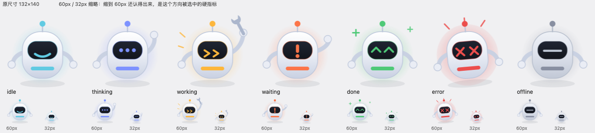

# xiaocc (小cc)

[中文说明](README.md) | English

A desktop companion that answers one question at a glance: what is my machine working on right now.

It has no chat window, no settings dialog, no account. It reads a state source, picks one of seven
states, and draws a small robot in the corner of your screen. When nothing is running, it dozes off.

Independent project. Not affiliated with, endorsed by, or derived from DeepSeek, the Hermes Agent
project, Google, Xiaomi, or any other desktop pet.



## Three layers that are usually welded together

Desktop pets tend to ship as one host, one set of sprites, and one window, all in the same codebase.
Point it at a different host and it stops working. Change how it looks and you edit code. Move to
another platform and you rewrite the window. xiaocc takes those three things apart, and each layer
only ever exchanges one data structure with the others:

| Layer | Answers | How to extend it |
| --- | --- | --- |
| `sources/` | what is happening? | subclass `StatusSource`, declare a `xiaocc.sources` entry point |
| `characters/` | what does it look like? | one directory with a `character.json` covering all seven states |
| `backends/` | where does it draw? | subclass `Backend`, declare a `xiaocc.backends` entry point |

The core package has no third-party dependencies, because it only deals with state and never touches
graphics. GUI libraries live in extras such as `xiaocc[macos]`, so a missing toolkit cannot take down
an install that only needs the terminal.

## Install

```bash
git clone https://github.com/<your-account>/xiaocc && cd xiaocc
python3 -m venv .venv && .venv/bin/pip install -e ".[dev]"

# optional: native macOS window
.venv/bin/pip install -e ".[macos]"
```

Python 3.11 or newer. CI runs the core suite on macOS, Ubuntu, and Windows, on 3.11 and 3.13; the
graphics code is never imported by those tests.

## Run it

```bash
xiaocc sources                            # what can drive it
xiaocc backends                           # what can draw it
xiaocc run --source hermes                # read a live agent session
xiaocc run --source hermes -b appkit      # same state, native macOS window
xiaocc where                              # paths and detected databases, first stop when something is off
```

Anything that can write a JSON file, or print one, can drive it:

```bash
echo '{"state":"working","detail":"compiling","step":2,"total":5}' > ~/.xiaocc/status.json
xiaocc run --source 'file:~/.xiaocc/status.json' -b terminal --once

( >  < ) 小cc [working]  compiling · 2/5

xiaocc run --source 'command:mytool status --json' -b terminal
```

Both are built in, along with a `hermes` source that reads a live agent database. The caption text
comes from whichever source is talking, so the Chinese in the screenshot below is the Hermes source
reporting in its own language, not a hardcoded string.

```
( >  < ) 小cc [working]  xiaocc · 正在执行 read_file
```

Add `--once` to run a single frame, which is how the tests and CI check the whole path end to end.

## The status protocol

Seven states, one wire format (a flat one-line JSON event). Higher priority wins when several sources
are alive; the TTL is what stops a dead job from spinning forever.

| State | Meaning | Priority | Expires after |
| --- | --- | --- | --- |
| `offline` | no source has anything to say | 0 | never |
| `done` | a round just finished | 1 | 12s |
| `idle` | online, not busy | 2 | never |
| `thinking` | received input, working it out | 3 | 90s |
| `working` | running a tool or a command | 4 | 45s |
| `waiting` | blocked on you | 5 | 10min |
| `error` | something needs a human | 6 | 90s |

Three rules the protocol enforces rather than trusting each source to remember:

- Progress appears only when a source reports real `step` and `total` numbers. No numbers, no
  percentage, no approximation.
- Stale events drop out. A job that died 90 seconds ago stops drawing a thinking face instead of
  pretending.
- Sources fail alone. A source that raises gets a log line and a mention in `Engine.health()`; the
  other sources keep drawing. `xiaocc run -v` shows the reason.

Returning `None` from `poll()` is not the same as reporting `offline`. `None` means this source has
nothing to say this round, and it changes nothing on screen.

## Add a source in three minutes

One class plus one entry point. Nothing in the core gets edited. The runnable version is
[`examples/pomodoro-source/`](examples/pomodoro-source/).

```python
# xiaocc_pomodoro.py
import time

from xiaocc.protocol import State, StatusEvent
from xiaocc.sources.base import StatusSource


class PomodoroSource(StatusSource):
    name = "pomodoro"
    description = "Pomodoro: 25 minutes of focus, then 5 off"
    interval = 1.0

    def __init__(self, minutes: float = 25.0) -> None:   # --source pomodoro:50 lands here
        self.minutes = float(minutes)
        self.started = time.time()

    def poll(self):
        elapsed = time.time() - self.started
        if elapsed < self.minutes * 60:
            return StatusEvent(source=self.name, state=State.WORKING,
                               project="pomodoro", detail="focusing")
        return StatusEvent(source=self.name, state=State.DONE, detail="round over")
```

```toml
[project.entry-points."xiaocc.sources"]
pomodoro = "xiaocc_pomodoro:PomodoroSource"
```

Install that package and it shows up. `xiaocc run --source pomodoro` uses the defaults;
`xiaocc run --source pomodoro:50` passes `50` as the first positional argument. A misspelled entry
point group does not raise an error, so run `xiaocc sources` after installing to confirm your source
was found.

The long form, including the eight mistakes people hit while writing one, is
[docs/sources_EN.md](docs/sources_EN.md) (the Chinese original is [docs/sources.md](docs/sources.md)).

## Characters are data

A character is a directory with a `character.json`: canvas size, palette, and all seven states, each
with a `motion`, an `accent` colour, and a caption, plus optional per-state art under `assets/` in
PNG or SVG. A state with no art gets a generic procedural fallback drawn from the palette, so a
half-finished character still appears on screen instead of a blank window.

```bash
xiaocc character validate ./my-character
xiaocc character list
```

The bundled character is 丸丸, a capsule robot with a dark visor and a light ring at its base. The
visor expression and the ring colour carry the state, which is why it stays readable at 60px. Art
specs, the per-state table, and how new art gets generated are in
[docs/design/丸丸-资产说明.md](docs/design/丸丸-资产说明.md).

Seven states is the protocol, not a preference. An eighth state is a breaking change and bumps
`PROTOCOL_VERSION`.

## Backends

| Name | Platform | What it does |
| --- | --- | --- |
| `console` / `terminal` | any | one line per frame; SSH, CI, and acceptance runs |
| `appkit` | macOS | transparent borderless panel, always on top, docks to the screen edge, expands on hover, click-through when the cursor is away from the character |

Backend options reach the backend's `__init__` through `--backend-opt`, so a backend declares named
parameters and the CLI passes them along:

```bash
xiaocc run --source hermes -b appkit --backend-opt at=bottom-right --backend-opt fps=30
```

`at` accepts `top-left`, `top-right`, `bottom-left`, `bottom-right`, `center`, or explicit `x,y`
coordinates. A bad value fails while loading and prints the valid ones. The alternative is an empty
desktop and a user who assumes the app is broken.

Windows and web backends do not exist yet. Both are entry points, so they can live in their own
packages.

## Screenshots are how the window code gets checked

Window behaviour is verified against a real window by script, not by reading code.
[`scripts/appkit_screenshots.py`](scripts/appkit_screenshots.py) injects a synthetic cursor (your
mouse is untouched), walks through drag, dock, hover, and leave, and asserts window level,
transparency, click-through, size, and whether the drawing view tracks the window at each step.
Twenty assertions, with the detail recorded in [`docs/evidence/evidence.json`](docs/evidence/evidence.json).

That discipline paid for itself three times. The collapsed handle was drawn in screen coordinates, so
captures returned the previous frame and four screenshots had identical bytes. The smiling eye arcs
inherited a stroke colour from the shell and faded to grey. The idle face was frowning. None of the
three is visible in a careful read of the source.

`docs/` is mostly Chinese for now, with English where it matters most:
[sources (EN)](docs/sources_EN.md), [sources (中文)](docs/sources.md),
[architecture](docs/architecture.md), [backends](docs/backends.md), [prior art](docs/PRIOR-ART.md),
[evidence](docs/evidence/README.md).

## Roadmap

- [x] protocol, engine, sources (`hermes`, `file`, `command`), character loading, macOS window, CI
- [ ] Windows and web backends
- [ ] a real `waiting` source (tool approval, pending review)
- [x] English guide for state sources ([docs/sources_EN.md](docs/sources_EN.md))
- [ ] English translations for the rest of `docs/`
- [ ] single-file build, so it runs without a Python install

## Provenance and boundaries

The seven state words (`offline`, `idle`, `thinking`, `working`, `waiting`, `done`, `error`) come from
the ordinary vocabulary of workflow states and were picked for this protocol. They are not taken from
another desktop pet's protocol. The wire format here is a flat one-line JSON event with lowercase
values.

We did read [`QCYTSN/dsh-dafeiyu`](https://github.com/QCYTSN/dsh-dafeiyu) while planning this, and
wrote down which of its engineering ideas are fair to borrow and which would amount to copying in
[docs/PRIOR-ART.md](docs/PRIOR-ART.md). No code, art, prompts, documentation structure, or example
text from it appears here. Its character frames are explicitly excluded from its MIT license, and none
of them are used; the same holds for the third-party frames and the Chromium-derived cursors it ships.

Art here is original: programmatic vector art produced with AI assistance, then reviewed by hand.
Generation specs and the state-by-state reference are archived in `docs/design/`, so the claim can be
checked. Same MIT license as the code.

## License

MIT for the code and for the art. See [LICENSE](LICENSE) and [ASSET_LICENSE.md](ASSET_LICENSE.md).
